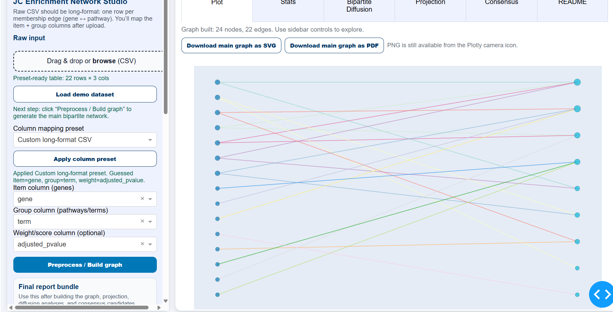
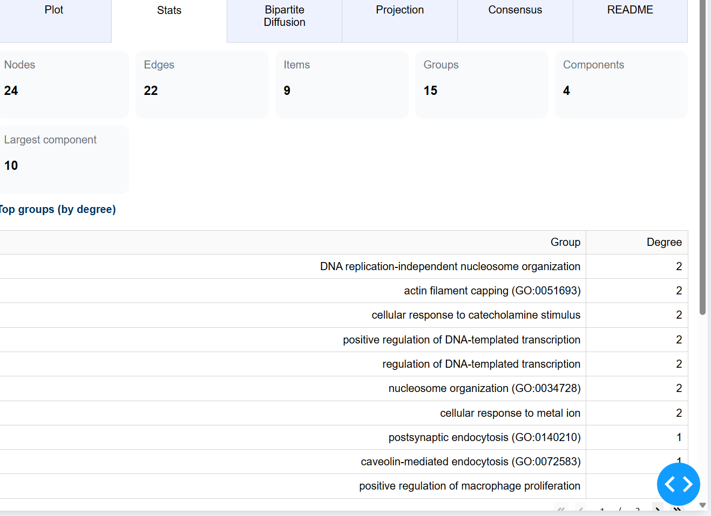
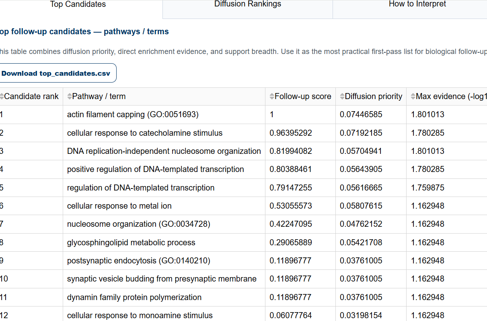
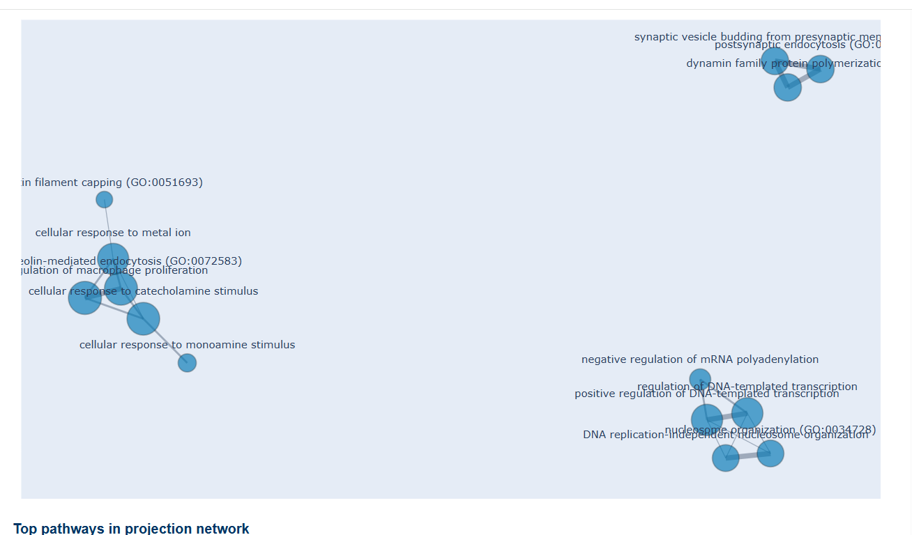
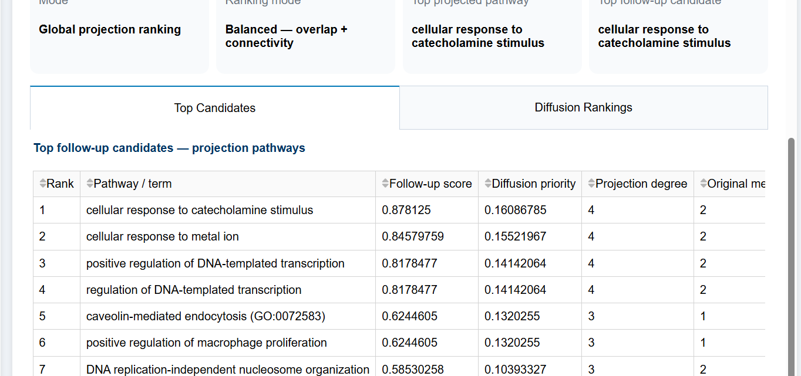
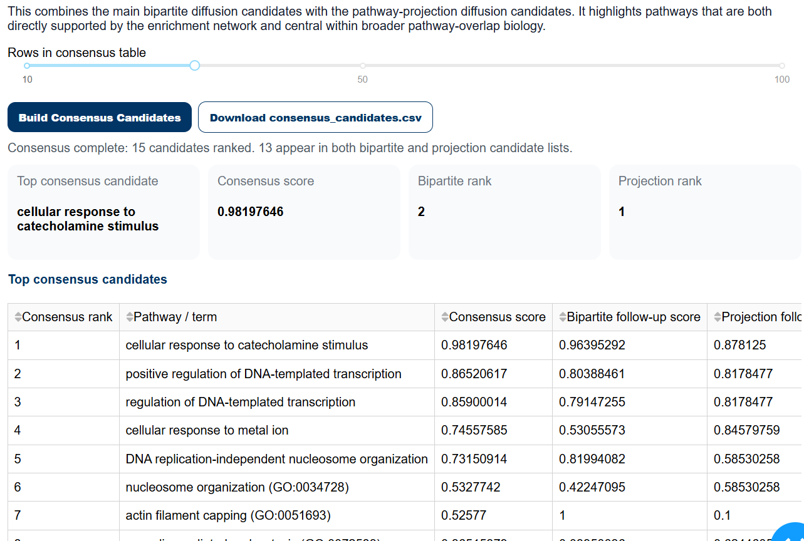

# JC Enrichment Network Studio

**A zero-preprocessing enrichment network workbench for turning pathway enrichment results into interactive gene-pathway networks, pathway-overlap projections, diffusion-based candidate rankings, and reproducible export bundles.**


---

## 📸 Screenshots

### Main Network + Sidebar Controls

The main workflow starts with uploading or loading enrichment data, selecting a preset, mapping columns, and building the gene ↔ pathway network.



---

### Network Statistics

The Stats tab summarizes graph size, connected components, top pathways/groups, top genes/items, and edge-weight information.



---

### Bipartite Diffusion Rankings

The Bipartite Diffusion tab ranks pathways and genes/items using random-walk diffusion over the main gene ↔ pathway graph.



---

### Pathway Projection Graph

The Projection tab builds a pathway ↔ pathway overlap network from shared genes/items.



---

### Projection Rankings

Projection rankings identify central pathway themes in the pathway-only overlap graph.



---

### Consensus Candidates

Consensus candidates combine bipartite diffusion and projection diffusion signals into a final prioritized pathway list.



---

### Export Buttons

The sidebar includes full Network Studio report export and LLM Triage bundle export. The LLM Triage export is a safe handoff bundle and does not run a live public LLM call.


---

👉 **Live App:**  
https://jc-enrichment-network-studio121-390287836436.northamerica-northeast1.run.app/


---

## 🚀 What This Is

Most enrichment tools give you a ranked table of pathways.

**JC Enrichment Network Studio** helps answer the next question:

> Which enriched biological themes are connected, supported by multiple genes, and worth following up?

The app lets users upload enrichment-style results, map or preset columns, build interactive networks, rank follow-up candidates, and export reproducible node/edge/result bundles.

It is designed as a focused enrichment-network workflow, not a general Cytoscape replacement.

---

## 🧠 Core Workflow

1. Upload enrichment results or load the demo dataset.
2. Select a column mapping preset or manually map columns.
3. Build the main gene ↔ pathway bipartite network.
4. Build a pathway ↔ pathway projection network.
5. Run diffusion ranking on the main network.
6. Run diffusion ranking on the projection network.
7. Build consensus candidate rankings.
8. Export figures, CSVs, report bundles, or LLM Triage input bundles.

---

## ✨ Features

### 🔹 One-Click Demo Dataset

The app includes a demo workflow so users can immediately test the full pipeline without preparing a file first.

The demo loads enrichment-style data, expands gene lists when needed, maps columns, and prepares the user to build the network.

---

### 🔹 Column Mapping Presets

Supported input presets include:

- Custom long-format CSV
- Enrichr-style results
- g:Profiler / gprofiler2-style results
- clusterProfiler-style results
- GSEA / MSigDB-style long-format results

This reduces preprocessing friction and helps users move from enrichment output to network exploration faster.

---

### 🔹 Bipartite Gene ↔ Pathway Network

Builds a main enrichment network where:

- genes/items connect to pathways/terms
- adjusted p-values can be transformed into `-log10(adjusted p-value)` weights
- users can filter by search term, degree, edge weight, max groups, and largest component
- Plotly provides interactive exploration

---

### 🔹 Main Graph Diffusion Ranking

Runs random-walk / PageRank-style ranking over the main gene-pathway network.

Ranking modes:

- **Balanced** — combines enrichment evidence and connectivity
- **Evidence-weighted** — emphasizes strong adjusted p-values
- **Connectivity-weighted** — emphasizes network hubs and shared structure

Outputs include pathway rankings, gene rankings, and top follow-up candidates.

---

### 🔹 Top Candidate Identification

The candidate table combines:

- diffusion priority
- direct enrichment evidence
- support breadth / degree

These scores are intended for **follow-up prioritization**, not as new statistical p-values.

---

### 🔹 Pathway Projection Network

Builds a pathway-only graph where pathways are connected when they share genes/items.

Projection edge modes include:

- Jaccard similarity
- shared gene count
- weighted shared support

This helps reveal overlapping biological modules and pathway clusters.

---

### 🔹 Projection Diffusion

Runs diffusion ranking on the pathway-only projection graph.

This identifies central biological processes based on pathway overlap structure rather than the original gene-pathway bipartite graph alone.

---

### 🔹 Consensus Candidates

Combines signal from:

- main bipartite diffusion candidates
- projection diffusion candidates

The result is a consensus pathway ranking that highlights terms supported by both direct enrichment-network structure and pathway-overlap structure.

---

## 📦 Export Options

### Individual Exports

The app supports:

- PNG export through the Plotly UI
- SVG export
- PDF export
- main graph node/edge CSVs
- projection graph node/edge CSVs
- diffusion result CSVs
- candidate ranking CSVs
- consensus candidate CSVs

---

### Full Network Studio Report Bundle

The app can export a full reproducible report bundle containing:

```text
report_bundle/
  run_summary.html
  manifest.json
  mapped_columns.json
  settings.json
  input_preview.csv
  main_nodes.csv
  main_edges.csv
  graph_stats.csv
  projection_nodes.csv
  projection_edges.csv
  bipartite_diffusion_results.csv
  bipartite_top_candidates.csv
  projection_diffusion_results.csv
  projection_top_candidates.csv
  consensus_candidates.csv
  interpretation_notes.md
  main_graph.svg
  main_graph.pdf
  projection_graph.svg
  projection_graph.pdf

Static graph image exports may depend on the local/server Plotly-Kaleido environment. CSV outputs and summary files remain the primary reproducible artifacts.

🤖 Optional LLM Triage Export

The public Network Studio app does not run live LLM interpretation and does not spend API credits.

Instead, it provides a safe export-based connection to a companion LLM Triage workflow.

The app can export:
llm_triage_input/
  run_summary.json
  mapped_columns.json
  settings_manifest.json
  input_preview.csv
  main_nodes.csv
  main_edges.csv
  projection_nodes.csv
  projection_edges.csv
  bipartite_diffusion_results.csv
  bipartite_top_candidates.csv
  projection_diffusion_results.csv
  projection_top_candidates.csv
  consensus_candidates.csv
  interpretation_notes.md

This bundle can later be used with:

local LLM Triage workflows
bring-your-own-key setups
private deployments
paid hosted workflows
consulting/report-generation workflows

This keeps the public demo cost-controlled while still supporting AI-assisted interpretation as an optional companion workflow.

🧪 Input Formats
Custom Long-Format CSV

The simplest input is one row per gene-pathway membership edge:
| gene  | term     | adjusted_pvalue |
| ----- | -------- | --------------- |
| GeneA | Pathway1 | 0.01            |
| GeneB | Pathway1 | 0.01            |
| GeneB | Pathway2 | 0.04            |

The adjusted p-value column is optional but recommended.

Enrichr-Style CSV

Example:
| Term           | Genes           | Adjusted.P.value |
| -------------- | --------------- | ---------------- |
| DNA repair     | BRCA1;RAD51;ATM | 0.003            |
| MAPK signaling | MAPK1;CREB1     | 0.012            |


The preset expands semicolon-separated genes into long-format edges.

g:Profiler / gprofiler2-Style CSV

Example columns may include

| name                    | p_value | intersections      |
| ----------------------- | ------- | ------------------ |
| nucleosome organization | 0.002   | SUPT16H,H3-3A,HIRA |


The preset expands intersection genes into long-format edges.

GSEA / MSigDB-Style Long CSV

Example:
| term                 | gene    | adjusted_pvalue |
| -------------------- | ------- | --------------- |
| HALLMARK_E2F_TARGETS | SUPT16H | 0.01            |
| HALLMARK_E2F_TARGETS | SUPT5H  | 0.01            |

⚠️ Interpretation Caveats

Network Studio does not create new statistical significance values.

Use terms carefully:

Adjusted p-value: statistical enrichment evidence from the input table
Edge weight: transformed evidence, often -log10(adjusted p-value)
Diffusion score: network prioritization score, not a p-value
Follow-up score: practical triage score combining diffusion, evidence, and support breadth
Consensus score: agreement between main bipartite and pathway-projection rankings
Projection network: pathway-overlap graph, not a replacement for the main gene-pathway graph

LLM interpretation, if used through the companion workflow, should be treated as assistive and reviewed by a scientist.

📌 Use Cases
RNA-seq pathway interpretation
scRNA-seq enrichment exploration
ATAC-seq functional annotation follow-up
GWAS enrichment exploration
Functional genomics hypothesis generation
Comparing pathway overlap across enriched terms
Exporting clean node/edge tables for downstream tools like Cytoscape
🧠 Why This Tool?

Standard enrichment analysis answers:

What is statistically enriched?

Network Studio helps answer:

What is connected, biologically coherent, and worth following up?

It is especially useful when enrichment results contain many overlapping pathways and users need a fast way to visualize structure, identify hubs, and prioritize candidate biological themes.

🧱 Tech Stack
Python
Dash
Plotly
NetworkX
pandas
NumPy
SciPy
Docker
Google Cloud Run
⚙️ Local Setup

in bash

git clone https://github.com/jcaperella29/JC-Enrichment-Network-Studio.git
cd JC-Enrichment-Network-Studio/Network_Vis_App
pip install -r requirements.txt
python app.py

Then open:
http://localhost:8050

🐳 Docker Setup
in bash
docker build -t enrichment-network .
docker run -p 8050:8050 enrichment-network
then open same as before

🌐 Deployment

The public app is deployed on Google Cloud Run for containerized execution.

The public version is designed to be cost-controlled: it performs local graph/statistics/export workflows and does not expose an unrestricted hosted LLM interpretation endpoint.

🧭 Positioning

This is not a universal network science platform.

It is a focused enrichment-network studio for scientists who want to:

upload enrichment results
avoid manual Cytoscape preprocessing
build gene-pathway and pathway-overlap networks
rank follow-up biological themes
export reproducible figures and node/edge/result tables
optionally hand off results to a separate LLM Triage workflow
